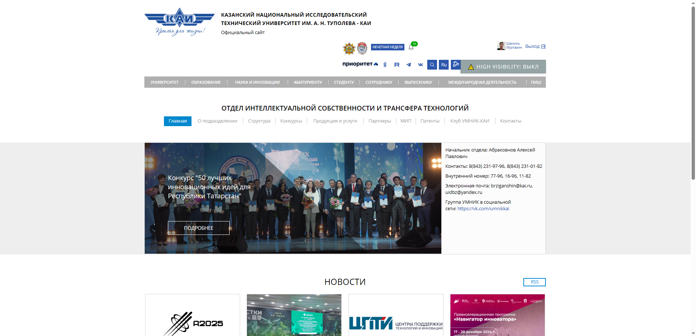
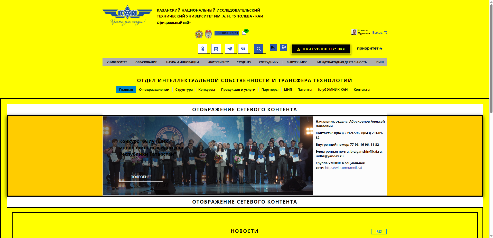
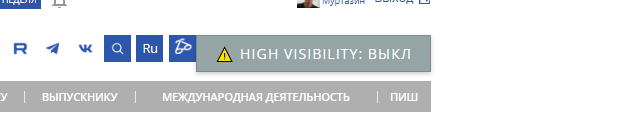
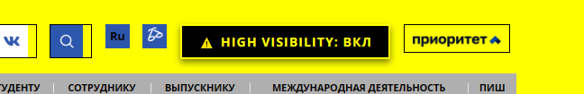
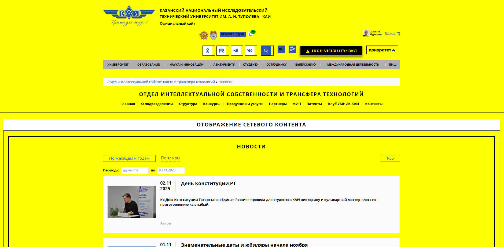

# KAI High Visibility Style Switcher - Расширение для Chrome

## 📝 Описание проекта

**KAI High Visibility Style Switcher** - это расширение для браузера Google Chrome (и Yandex Browser), которое применяет стиль высокой видимости к сайту kai.ru. Стиль основан на неоново-желтом фоне (#ffff00) и черном жирном тексте, что широко используется на строительных сайтах для максимальной контрастности и читаемости.

### Основные возможности:
- ⚠️ Применение High Visibility темы (желтый фон + черный текст)
- 💾 Сохранение состояния стиля в localStorage
- 🔄 Автоматическое применение сохраненного стиля при загрузке страницы
- 🖱️ Визуальная индикация текущего состояния на кнопке
- ✨ Плавные анимации переходов
- 🏗️ Стиль, вдохновленный строительными и предупреждающими знаками

## 🛠️ Технические детали

### Измененные стили (более 8):
1. **Фон главной обертки** - неоново-желтый (#ffff00)
2. **Цвет текста** - черный (#000000)
3. **Жирность шрифта** - bold/900 для всех текстовых элементов
4. **Фон слайдера** - желто-оранжевый (#ffcc00)
5. **Границы** - жирные черные рамки (3-5px)
6. **Скругление углов** - убрано (border-radius: 0)
7. **Тени** - контрастные черные тени
8. **Фон блоков новостей** - желтый с черными рамками
9. **Стиль ссылок** - черный текст, желтый фон, жирное подчеркивание
10. **Заголовки** - uppercase, увеличенный spacing
11. **Отступы** - увеличены для лучшей читаемости (padding: 25px)
12. **Кнопки** - инверсия цветов (черный фон, желтый текст)
13. **Размер шрифта** - увеличен до 1.5em для заголовков
14. **Text-decoration** - жирное подчеркивание (3px) для ссылок

### Используемые DOM методы:
- ✅ `getElementById` - для доступа к главной обертке страницы
- ✅ `querySelector` - для единичных элементов (слайдер, контент-область)
- ✅ `querySelectorAll` - для множественных элементов (новости, ссылки, заголовки, параграфы, кнопки)
- ✅ `parentElement` - для доступа к родительскому элементу
- ✅ `children` - для доступа к дочерним элементам

### Сложные селекторы:
- `.box_links a, .main_menu a` - множественный селектор для ссылок навигации
- `h1, h2, h3, .news_title` - комбинированный селектор для всех заголовков
- `.content_area, #content` - селектор с классом и ID для контентной области
- `button, .button, input[type="submit"]` - множественный селектор для кнопок
- `p, span, div, li` - селектор для всех текстовых элементов

## 🎨 Концепция дизайна

**High Visibility** (высокая видимость) - это стиль, основанный на максимальной контрастности между фоном и текстом. Используется в:
- 🏗️ Строительных сайтах и знаках безопасности
- ⚠️ Предупреждающих табличках
- 🚧 Дорожных знаках
- 📋 Документации с высокими требованиями к читаемости

**Цветовая схема:**
- **Основной фон:** #ffff00 (неоново-желтый)
- **Текст:** #000000 (черный, жирный)
- **Акцент:** инверсия цветов для кнопок

## 📦 Установка и запуск

### Шаг 1: Клонирование репозитория
```bash
git clone <URL-репозитория>
cd lab3-dom/solutions/student-21
```

### Шаг 2: Установка расширения в Chrome

1. Откройте Google Chrome (или Yandex Browser)
2. Перейдите на страницу расширений:
   - Chrome: `chrome://extensions/`
   - Yandex: `browser://extensions/`
3. Включите **Режим разработчика** (Developer mode) в правом верхнем углу
4. Нажмите кнопку **Загрузить распакованное расширение** (Load unpacked)
5. Выберите папку `student-21` с файлами расширения
6. Расширение установлено! ✅

### Шаг 3: Использование

1. Перейдите на сайт [kai.ru](https://kai.ru)
2. На странице появится кнопка **"⚠️ High Visibility: ВЫКЛ"**
3. Нажмите на кнопку для активации стиля высокой видимости
4. Кнопка изменится на **"⚠️ High Visibility: ВКЛ"** и стили применятся
5. При перезагрузке страницы выбранный стиль сохранится

## 📸 Примеры работы

### Стандартный вид сайта

*Исходный вид главной страницы kai.ru*

### С применением High Visibility стиля

*Главная страница с желтым фоном и черным жирным текстом*

### Кнопка переключения

*Кнопка в состоянии "High Visibility: ВЫКЛ"*


*Кнопка в состоянии "High Visibility: ВКЛ" (черный фон, желтый текст)*

### Примеры элементов

*Примеры стилизованных заголовков, ссылок и блоков новостей*

## 📋 Требования

- Google Chrome версии 88+ или Yandex Browser
- Доступ к сайту kai.ru

## 🔧 Структура файлов

```
student-21/
├── manifest.json       # Манифест расширения
├── content.js          # Основная логика расширения
├── README.md           # Документация (этот файл)
└── images/             # Скриншоты и изображения
    ├── original.png              # Скриншот оригинала
    ├── high-visibility-style.png # Скриншот с High Visibility
    ├── button-off.png            # Кнопка выключена
    ├── button-on.png             # Кнопка включена
    └── elements-example.png      # Примеры элементов
```

## 💡 Особенности реализации

1. **Сохранение состояния**: Используется localStorage с ключом `kai-custom-style-enabled`
2. **Максимальная контрастность**: Соотношение контраста между желтым фоном и черным текстом близко к максимальному
3. **Соответствие требованиям**: 
   - Директива `'use strict'` в начале файла
   - Использование только `let` и `const` (без `var`)
   - Все необходимые DOM методы
   - Более 8 измененных стилей (всего 14+)
4. **Плавные переходы**: Использование CSS transitions для комфортного переключения
5. **Визуальная обратная связь**: Кнопка меняет цвет, текст и стиль в зависимости от состояния
6. **Жирный текст**: Все текстовые элементы получают `font-weight: bold` или `900`
7. **Отсутствие скруглений**: `border-radius: 0` для строгого индустриального вида

## 🎯 Выполнение требований задания

### Функциональные требования:
- ✅ Кнопка для переключения стиля добавлена на главную страницу
- ✅ Кнопка отображает текущий статус (ВКЛ/ВЫКЛ)
- ✅ Состояние сохраняется при перезагрузке страницы (localStorage)
- ✅ Изменение стиля работает на главной странице и других страницах навигации

### Нефункциональные требования:
- ✅ Изменено более 8 стилей страницы (14+ стилевых изменений)
- ✅ Использованы все требуемые методы DOM (getElementById, querySelector, querySelectorAll, parentElement, children)
- ✅ Присутствуют сложные селекторы (множественные, комбинированные)
- ✅ Файлы manifest.json, content.js, README.md созданы
- ✅ Папка images для скриншотов подготовлена
- ✅ README содержит подробное описание, инструкцию и ссылки на изображения
- ✅ Код использует 'use strict', let/const (без var)

### Бонусные особенности:
- ⭐ Детальная документация с объяснением концепции High Visibility
- ⭐ Расширенная стилизация кнопок и интерактивных элементов
- ⭐ Использование uppercase и letter-spacing для заголовков
- ⭐ Инверсия цветов для кнопок (черный фон, желтый текст)

## 🚨 Предупреждения и рекомендации

⚠️ **Важно:** High Visibility стиль создан для максимальной контрастности и может быть визуально агрессивным. Рекомендуется использовать только при необходимости высокой читаемости или в специфических условиях (плохое освещение, большое расстояние от экрана и т.д.).

## 👨‍💻 Автор

**Студент:** 21  
**Курс:** 6310  
**Лабораторная работа:** №3 - DOM манипуляции  
**Вариант:** High Visibility (для строительных сайтов)

---

**⚠️ Используйте High Visibility с осторожностью! 🏗️**
