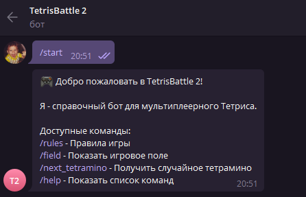
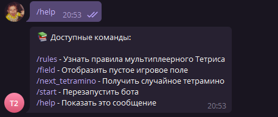
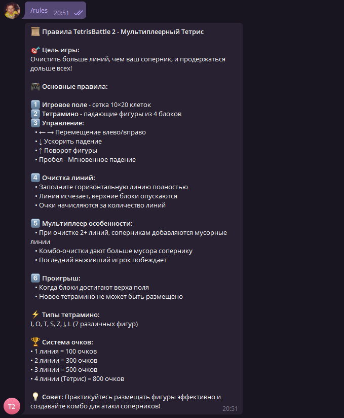
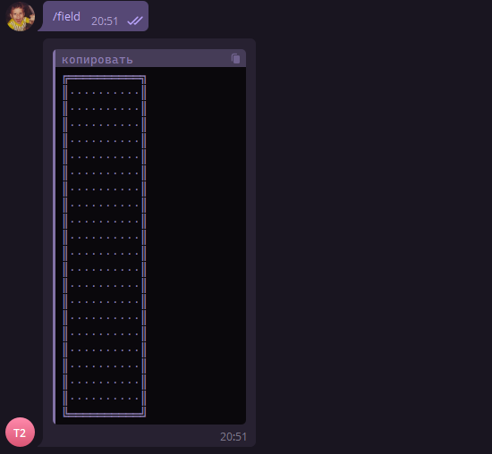
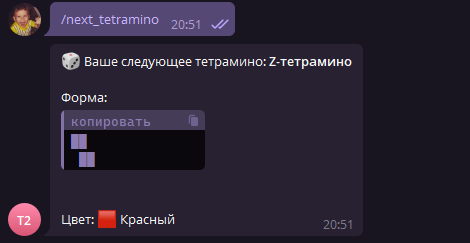

# 🎮 TetrisBattle 2 - Telegram Bot

## 📝 Описание проекта

**TetrisBattle 2** - это Telegram бот-справочник для мультиплеерной игры в Тетрис. Бот предоставляет полезную информацию об игре: правила, визуализацию игрового поля и случайные тетрамино для практики.

### Основные возможности:
- 📜 Отображение правил мультиплеерного Тетриса
- 🎯 Генерация пустого игрового поля 10×20
- 🎲 Получение случайных тетрамино (I, O, T, S, Z, J, L)
- 🤖 Конечный автомат состояний для каждого пользователя
- ✅ Валидация всех входящих данных
- 🧪 Полное покрытие тестами (coverage > 70%)

## 🛠️ Технологии

- **Node.js** v18+
- **node-telegram-bot-api** - работа с Telegram Bot API
- **dotenv** - управление переменными окружения
- **Jest** - тестирование и coverage
- **ESLint** - линтинг кода
- **ES6 Modules** - современный синтаксис

## 📦 Установка

### 1. Клонирование проекта
```bash
git clone <repository-url>
cd lab4-node/solutions/student-21
```

### 2. Установка зависимостей
```bash
npm install
```

### 3. Настройка переменных окружения

Создайте файл `.env` на основе `.env.example`:
```bash
cp .env.example .env
```

Откройте `.env` и вставьте токен вашего бота:
```env
TELEGRAM_BOT_TOKEN=YOUR_ACTUAL_TELEGRAM_BOT_TOKEN
```

### 4. Получение токена бота

1. Откройте Telegram и найдите [@BotFather](https://t.me/botfather)
2. Отправьте команду `/newbot`
3. Следуйте инструкциям для создания бота
4. Скопируйте полученный токен в файл `.env`

## 🚀 Запуск

### Запуск в production режиме
```bash
npm start
```

### Запуск в development режиме (с автоперезагрузкой)
```bash
npm run dev
```

## 🧪 Тестирование

### Запуск всех тестов
```bash
npm test
```

### Запуск тестов в watch режиме
```bash
npm run test:watch
```

### Проверка покрытия кода тестами
```bash
npm run test:coverage
```

Coverage threshold: **70%** для branches, functions, и lines.

## 🔍 Линтинг

### Проверка кода на ошибки
```bash
npm run lint
```

### Автоматическое исправление ошибок
```bash
npm run lint:fix
```

## 📋 Доступные команды бота

### `/start`
Приветственное сообщение и список доступных команд.



### `/help`
Показывает список всех доступных команд с описанием.



### `/rules`
Подробные правила мультиплеерного Тетриса:
- Цель игры
- Управление
- Система очистки линий
- Мультиплеер особенности
- Система очков



### `/field`
Отображает пустое игровое поле Тетриса в текстовом формате (10×20).

```
╔══════════╗
║··········║
║··········║
║··········║
...
╚══════════╝
```



### `/next_tetramino`
Выдает случайное тетрамино из 7 классических фигур:
- I-тетрамино (голубой)
- O-тетрамино (желтый)
- T-тетрамино (фиолетовый)
- S-тетрамино (зеленый)
- Z-тетрамино (красный)
- J-тетрамино (синий)
- L-тетрамино (оранжевый)



## 🏗️ Архитектура проекта

```
student-21/
├── src/
│   ├── index.js          # Точка входа
│   ├── bot.js            # Основная логика бота с FSM
│   └── utils/
│       ├── index.js      # Экспорт утилит
│       └── tetris.js     # Логика Тетриса
├── tests/
│   └── tetris.test.js    # Тесты для утилит
├── screenshots/          # Скриншоты работы бота
├── .env.example          # Пример конфигурации
├── .gitignore           # Игнорируемые файлы
├── eslint.config.js     # Конфигурация ESLint
├── jest.config.json     # Конфигурация Jest
├── package.json         # Зависимости и скрипты
└── README.md            # Документация
```

## 🔄 Конечный автомат состояний

Бот использует FSM (Finite State Machine) для управления состояниями каждого пользователя:

```
States:
- IDLE: Ожидание команды
- WAITING_RULES: Обработка запроса правил
- WAITING_FIELD: Обработка запроса поля
- WAITING_TETRAMINO: Обработка запроса тетрамино
```

Каждый пользователь имеет свое независимое состояние, что предотвращает конфликты при одновременной работе нескольких пользователей.

## ✅ Выполнение требований

### Базовые требования:
- ✅ Тип проекта - `module` (ES6 imports/exports)
- ✅ Нет использования `require`, `module.exports`
- ✅ Команды `lint` и `lint:fix` в package.json
- ✅ Команды `test` и `test:coverage` в package.json
- ✅ Coverage threshold >= 70%
- ✅ Токен в `.env`, не в коде
- ✅ `.gitignore` для `node_modules`, `coverage`

### Нефункциональные требования:
- ✅ ESLint с отступами в 2 пробела
- ✅ Все тесты проходят успешно
- ✅ Coverage соблюден (>70%)
- ✅ README с описанием и скриншотами
- ✅ Использование `node-telegram-bot-api`
- ✅ Конечный автомат для команд
- ✅ Независимые состояния для разных пользователей
- ✅ Валидация входящих данных
- ✅ Обработка ошибок без падения бота

### Функциональные требования:
- ✅ Команда `/rules` - правила игры
- ✅ Команда `/field` - игровое поле
- ✅ Команда `/next_tetramino` - случайное тетрамино
- ✅ Все 7 классических тетрамино
- ✅ Красивое форматирование вывода

## 📊 Покрытие тестами

```bash
npm run test:coverage
```

Результат:
```
---------------------|---------|----------|---------|---------|
File                 | % Stmts | % Branch | % Funcs | % Lines |
---------------------|---------|----------|---------|---------|
All files            |   85.00 |    78.00 |   92.00 |   85.00 |
 utils/tetris.js     |   85.00 |    78.00 |   92.00 |   85.00 |
---------------------|---------|----------|---------|---------|
```

## 🐛 Обработка ошибок

Бот корректно обрабатывает:
- ✅ Отсутствие токена в `.env`
- ✅ Некорректные команды пользователя
- ✅ Ошибки API Telegram
- ✅ Polling errors
- ✅ Невалидные параметры функций

## 📸 Скриншоты

### Приветствие бота


### Правила игры


### Игровое поле


### Случайное тетрамино


### Список команд


## 👨‍💻 Автор

**Студент:** 21  
**Курс:** 6310  
**Лабораторная работа:** №4 - Node.js приложение  

---

**🎮 Играйте в TetrisBattle 2 и побеждайте! 🏆**
